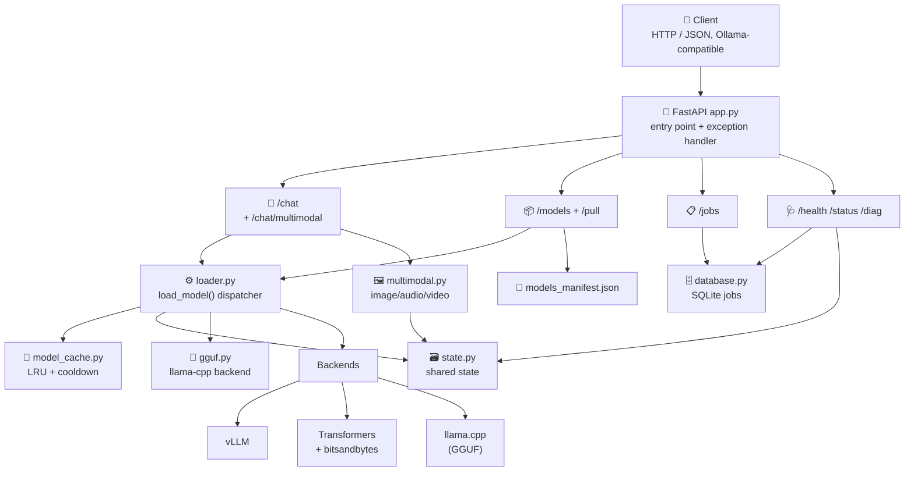

# Architecture Decision Record

**Project:** Private AI Inference Server
**Date:** 2026-08-12
**Author:** Fabio Pacifici - NSA Agency (neverslave.com)

## Decision

A single-process FastAPI server (`app.py` as thin entry point) that serves Hugging Face
language models with GPU acceleration, explicit download control, automatic
quantization, and intelligent caching. The core logic lives in a modular `src/`
package so each concern (config, state, loading, backends, routing) is isolated and
testable.

## Architecture diagram

## Context

This project is a private, self-hosted alternative to Ollama. It was originally a
single 1800-line `app.py`, which became difficult to maintain, test, and extend.
The server must:

- Serve both text and multimodal chat over HTTP with an Ollama-compatible response shape.
- Support multiple inference backends (vLLM, Transformers, GGUF/llama.cpp) with a
  predictable fallback chain.
- Download models explicitly via a `/pull` endpoint (never auto-download at inference).
- Run on a single consumer GPU (RTX 4090, 16GB VRAM) with CPU/RAM offloading for
  large models.
- Persist background pull jobs across restarts.
- Be observable (health, diagnostics, status) and debuggable (tracebacks in logs).

## Chosen platforms

- **Frontend:** None — HTTP/JSON API only (FastAPI auto-generated OpenAPI docs at `/docs`).
- **Backend:** Python 3.10+, FastAPI, uvicorn.
- **Database:** SQLite (via `src/database.py`, a `JobDatabase` class) for persistent
  pull-job state (`jobs.db`).
- **Deploy:** Local / self-hosted; `docker-compose.yml` and `Dockerfile` provided;
  WSL startup script (`scripts/start-wsl-server.sh`).

## Main components

- **`app.py`** — thin entry point: `sys.path` setup, FastAPI app, global exception
  handler, router wiring, DB + manifest init.
- **`src/config.py`** — environment setup (`.env`), optional backend imports with
  availability flags, constants, logging config.
- **`src/state.py`** — shared mutable server state (model cache, metadata, failed loads).
- **`src/schemas.py`** — Pydantic request models (chat, multimodal).
- **`src/model_cache.py`** — LRU eviction, cooldown tracking, cache_model().
- **`src/loader.py`** — `load_model()` dispatcher (vLLM → GGUF → Transformers),
  model-size probing, local-path resolution, and the `models_manifest.json` persistence.
- **`src/gguf.py`** — GGUF backend via llama-cpp-python + prompt building.
- **`src/multimodal.py`** — multimodal model loading, media decoding, inference, streaming.
- **`src/database.py`** — SQLite-backed job storage.
- **`src/routes/`** — FastAPI routers: `chat`, `models`, `jobs`, `system`.
- **`src/utils.py`** — `with_timeout()` helper and GPU cleanup.

## Architectural decisions

- **Modular `src/` package over a single `app.py` file.**
  *Implicit alternative:* keep everything in one file.
  *Chosen:* split into focused modules for maintainability and testability.
- **Backend fallback chain: vLLM → GGUF/llama.cpp → Transformers.**
  *Implicit alternative:* a single backend.
  *Chosen:* support multiple runtimes so the server works across environments and
  model formats (HF safetensors and GGUF).
- **Explicit `/pull` before inference.**
  *Implicit alternative:* auto-download on first use (Ollama-style).
  *Chosen:* explicit download control to avoid surprise network/disk usage.
- **SQLite for job persistence.**
  *Implicit alternative:* in-memory job dict (cleared on restart).
  *Chosen:* survive restarts and survive background-task crashes.
- **Layer-splitting via `device_map="auto"` + `max_memory`.**
  *Implicit alternative:* load fully on GPU (OOM on large models).
  *Chosen:* cap GPU (`MAX_GPU_MEMORY`) and offload overflow to CPU RAM.
- **`models_manifest.json` for model discovery persistence.**
  *Implicit alternative:* re-scan the filesystem on every request.
  *Chosen:* persist discovered local paths so `/chat` resolves models without re-scanning.
- **Disable HF symlinks on Windows (`HF_HUB_DISABLE_SYMLINKS=1`).**
  *Implicit alternative:* rely on symlinks (fails with WinError 1314 without Developer Mode).
  *Chosen:* copy files instead to avoid privilege errors.

## Constraints

- Target: RTX 4090 (16GB VRAM) with CUDA 12.x; 64GB+ system RAM for large-model offload.
- Python 3.10+.
- Windows primary target; Linux/WSL supported via scripts.
- Models must be explicitly pulled before inference (no auto-download).
- Large models (>20GB) auto-quantize to 4-bit when bitsandbytes is available.

## What is NOT in scope

- No authentication / multi-user access control (private, single-user server).
- No model training or fine-tuning.
- No distributed / multi-node inference.
- No automatic model download at inference time.
- No dedicated frontend UI (API only).

## Planned future features

- (filled together by the developer and the agent — see `.specs/plans/`)
